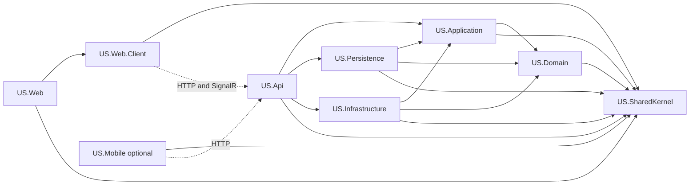
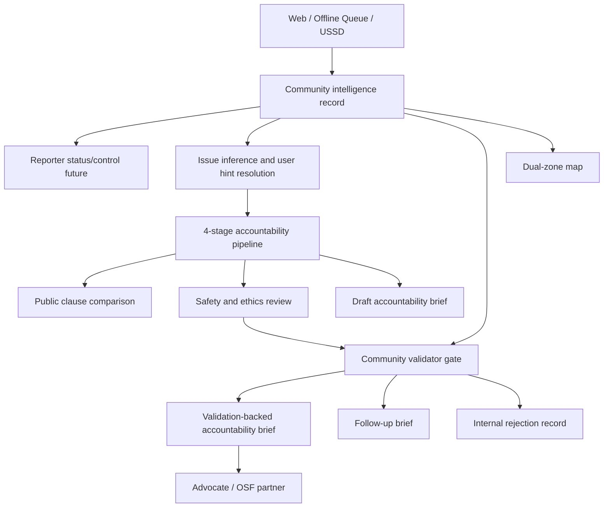

# Dependency Map

## Project Dependencies

## Product Flow

## Implementation Dependency Order

1. Architecture boundaries.
2. Report/case lifecycle.
3. Intake channels.
4. Seeded public clause comparison.
5. Agent pipeline.
6. Validation gate and status-aware outputs.
7. Dual-zone map.
8. Accountability brief/PDF.
9. Role-shaped UI.
10. Mobile simulator if time remains.

## Current Gaps

- Existing report store still lives in API feature code.
- PostgreSQL/pgvector-ready persistence is not implemented.
- Seeded policy comparison is implemented as a deterministic fallback over versioned API JSON corpus.
- OpenAI-backed runner exists behind configuration; current local demo often runs deterministic fallback unless `OPENAI_API_KEY` is configured.
- Dual-zone map combines seeded zones with submitted report zones; submitted coordinates are region-derived and should later move to precise geocoding/GPS.
- Role-shaped navigation is not implemented.
- PDF generation/export is not implemented yet.
- Validator notification foundation is not implemented yet.
