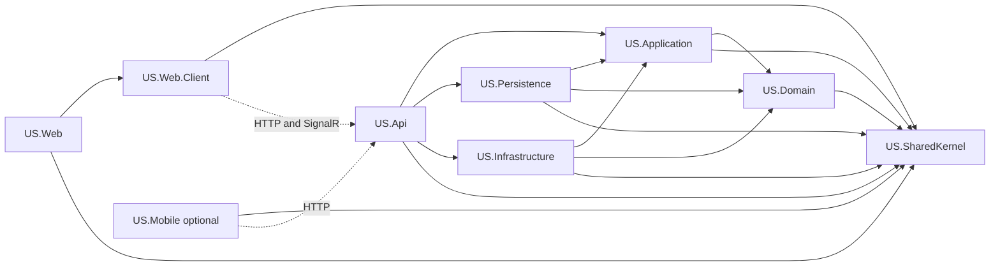
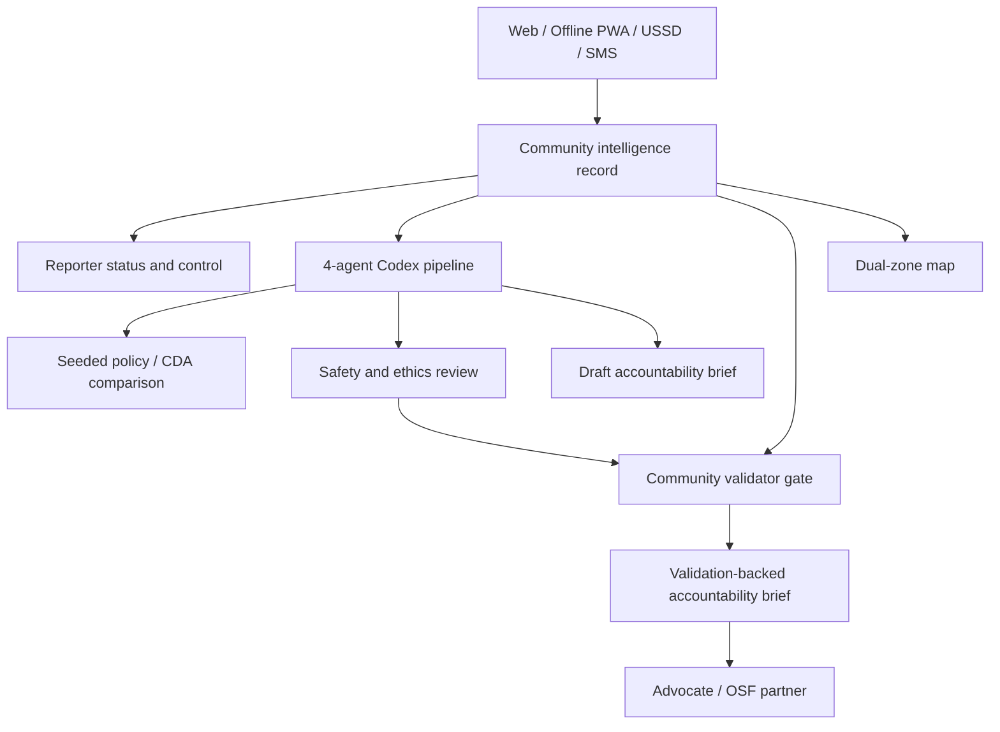

# Dependency Map

## Project Dependencies

## Product Flow

## Implementation Dependency Order

1. Architecture boundaries.
2. Report/case lifecycle migration.
3. Intake channel abstraction.
4. Seeded policy comparison.
5. Agent pipeline.
6. Validation gate.
7. Dual-zone map.
8. Accountability brief/PDF.
9. Role-shaped UI.
10. Mobile simulator if time remains.

## Current Gaps

- Existing report store still lives in API feature code.
- PostgreSQL/pgvector-ready persistence is not implemented.
- Seeded policy comparison is implemented as a deterministic RAG fallback.
- USSD simulator is implemented as a foundation and needs polish/status tracking.
- Dual-zone map is implemented as a seeded foundation and needs Leaflet/filters.
- Role-shaped navigation is not implemented.
- PDF generation is not implemented.
